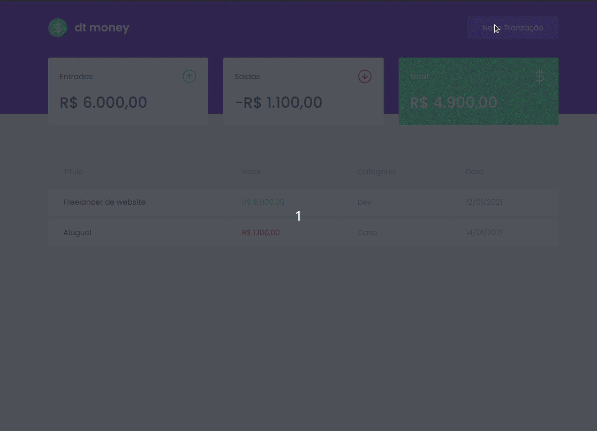

<div>
  <h1 align="center">DT_MONEY</h1>
  
  <div align="center">

  <a href="#sobre">Sobre</a> 
    |
  <a href="#tecnologias">Tecnólogias</a>
    |
  <a href="#dependencias">Utilizar projeto</a>
    |
  <a href="#Projeto">Pagina do projeto</a>

  </div>
</div>

<div >
<ul align="center">
  
  
</ul>

</div>


<div>
  <h3>Sobre.</h3>
  <h4 id="sobre">
  <b>Desenvolvido com REACT</b>
    Projeto com finalidade de organização de gastos, onde podemos ter o controle de entrada e saida do fluxo no mês.</h4>

  
</div>


<div id="tecnologias">
  <h3>Tecnológias.</h3>
  <ul>
    <li>
      <a href="https://pt-br.reactjs.org/docs/getting-started.html">REACT.Js
      </a>
    </li>
    <li>
      <a href="https://github.com/reactjs/react-modal">
        React-Modal.
      </a>
    </li>
     <li>
      <a href="https://miragejs.com/">
        Miragejs.
      </a>
    </li>
    <li>
      <a href="https://github.com/styled-components/styled-components">    
        Styled-components.
      </a>
    </li>
    <li>
      <a href="https://www.typescriptlang.org/">
        TypeScript.
      </a>
    </li>
    <li>
      <a href="https://nodejs.org/pt-br/docs/">
        NODE.JS.
      </a>
    </li>
    <li>
      <a href="https://classic.yarnpkg.com/en/docs/">
        YARN.
      </a>
    </li>
  </ul>
  
</div>

<div id="dependencias">

<h3>Baixar Projeto.</h3>  

```bash
# Clone this repository
$ git clone https://github.com/FullBarbosa/DT_money.git DtMoney

# Install dependencies Yarn
$ yarn install

# Install dependencies NPM
$ npm install 
```
 </div>

